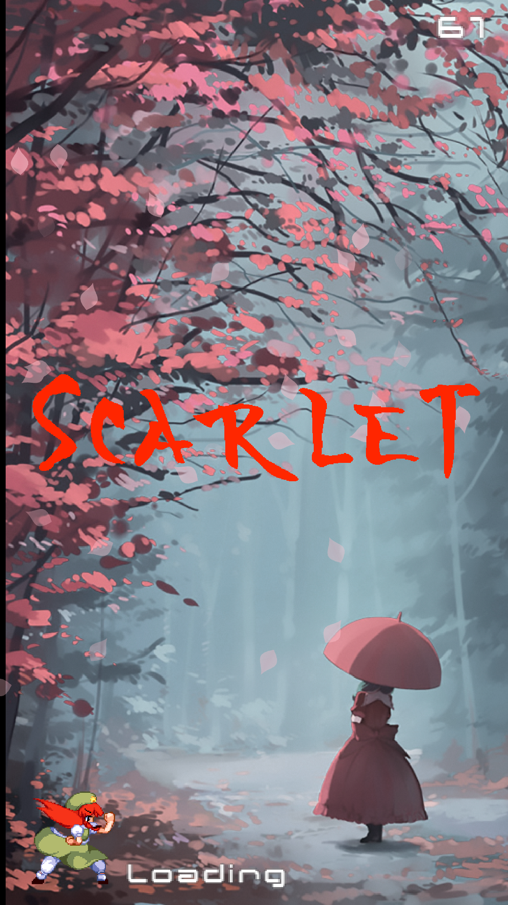

# Open Touhou Android

An open source Touhou fangame for Android.

Written in Java and C++ using OpenGL ES and OpenSL ES.

It's pretty bare bones for now.

Roadmap

Version 0.1.

Active branch: 0.1-a2

Major Goal: Create basic menu and loading screen.

https://youtu.be/zMbH5SXehFA
